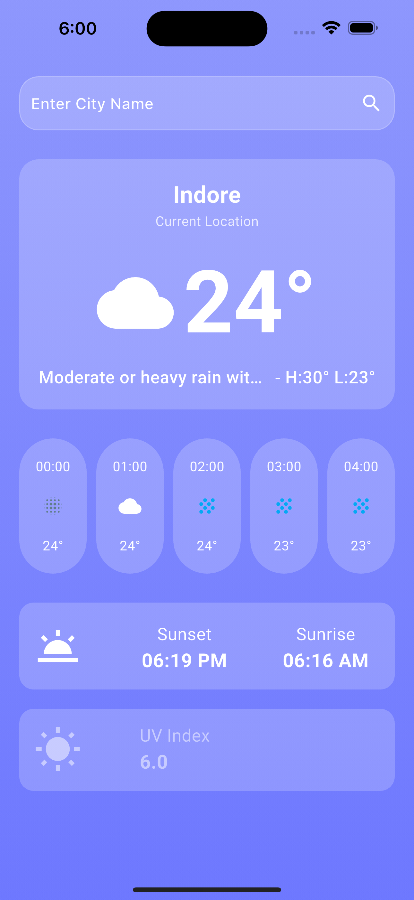

<<<<<<< HEAD
# ZeOptic_WeatherApp
=======
# zeoptic_weather

You can download the APK file for the ZeOptic Weather App from the following link:

[Download APK](https://drive.google.com/file/d/1yM_FP0Gs9awB3AzHlXObv8nHrEPnIQqQ/view?usp=drive_link)

A new Flutter project.

## Getting Started

This project is a starting point for a Flutter application.

A few resources to get you started if this is your first Flutter project:

- [Lab: Write your first Flutter app](https://docs.flutter.dev/get-started/codelab)
- [Cookbook: Useful Flutter samples](https://docs.flutter.dev/cookbook)

For help getting started with Flutter development, view the
[online documentation](https://docs.flutter.dev/), which offers tutorials,
samples, guidance on mobile development, and a full API reference.
>>>>>>> d970d77 (Final commit)
